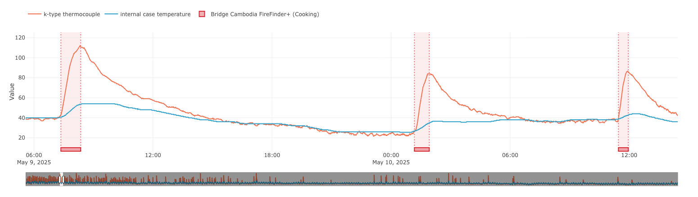

# firefinder

A small, standalone FireFinder+ implementation with the same core logic used in at Geocene, plus lightweight preprocessing helpers.



## Install

From PyPI:

```bash
pip install firefinder
```

Local editable install while developing:

```bash
pip install -e .
```

## Usage

```python
import pandas as pd
from firefinder import prepare_timeseries, fire_detector_v2, group_events

df = pd.read_csv("metrics.csv")
df = prepare_timeseries(df, correction="false")
df = fire_detector_v2(df)

events = group_events(df)
print(events.head())
```

If your timestamps are epoch milliseconds:

```python
import pandas as pd
from firefinder import prepare_timeseries, fire_detector_v2, group_events

df = pd.read_json("data.json")
df["timestamp"] = pd.to_datetime(df["timestamp"], unit="ms", utc=True, errors="coerce")
df = prepare_timeseries(df, correction="false")
df = fire_detector_v2(df)
events = group_events(df)
print(events.head())
```

## Testing

```bash
pip install -e .[test]
python -m pytest
```

## Required columns

- `timestamp`
- `value`
- `sensor_type_id` (required if `correction="true"`)

## Notes

- `prepare_timeseries` mirrors the cleaning behavior from the original lambda processor.
- `correction="true"` uses ambient `sensor_type_id=9` and stove `sensor_type_id=1` when computing ambient-corrected values.
- You can pass a custom `sensors` mapping into `prepare_timeseries` to support additional stove sensor IDs.
